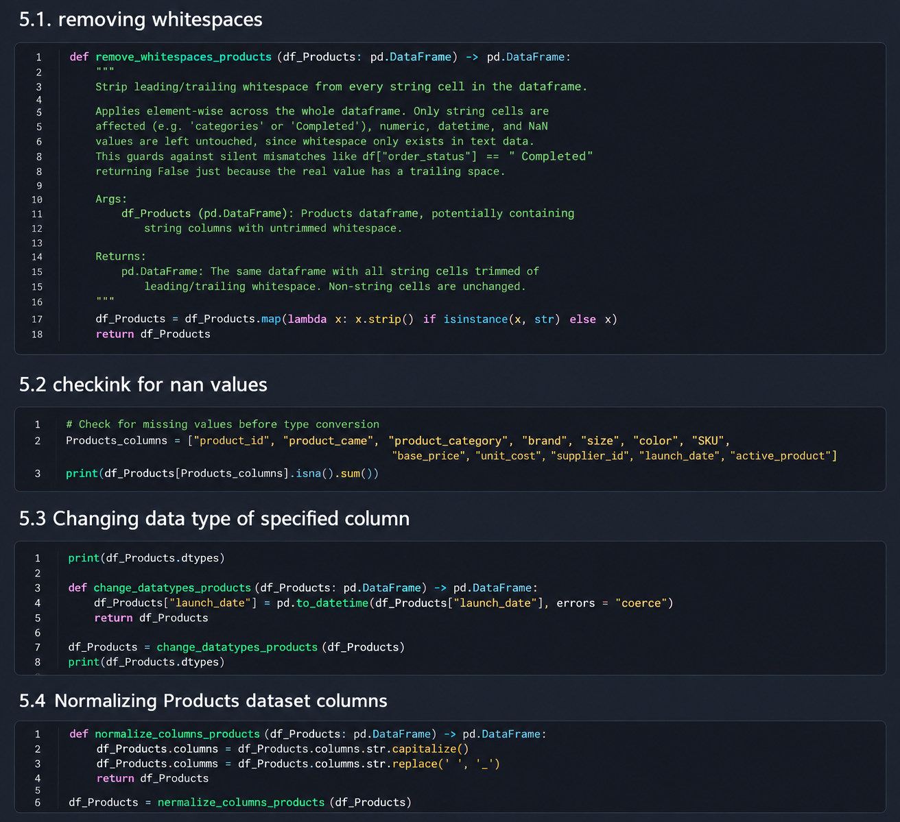
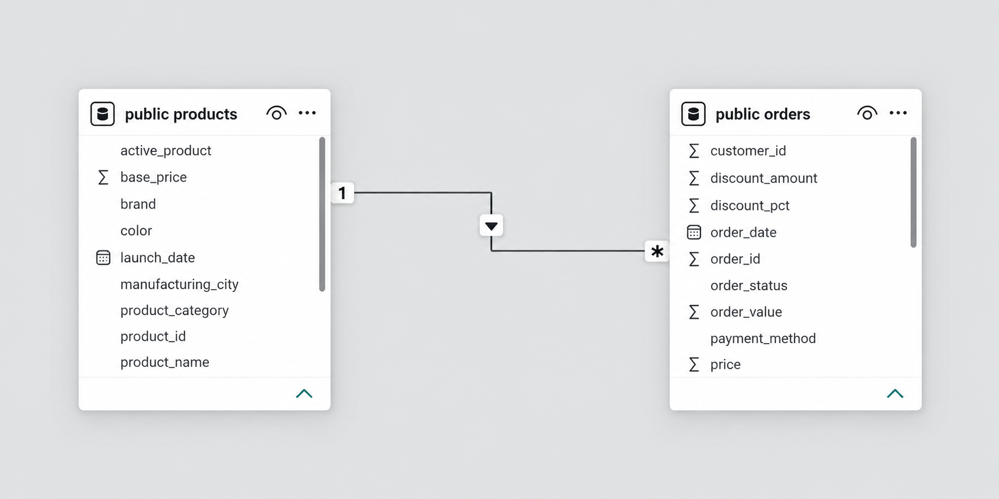

# 📊 End-to-End Sales Data Analysis

> An end-to-end Data Analyst portfolio project covering data preparation, 
> relational database design, SQL analysis and interactive business intelligence reporting.

---

## 🎯 Project Overview

This project demonstrates a complete **end-to-end data analytics workflow**, 
starting with raw CSV files and finishing with an interactive **Power BI dashboard**.

The project is based on two related datasets containing:

- 🧾 **5,000 customer orders**
- 📦 **20 products**
- 📅 Sales data covering **2025 and January–August 2026**
- 💰 Revenue, cost, discount, product and sales information

The objective was to transform and validate the raw data using **Python and Pandas**, 
store the cleaned datasets in a relational **PostgreSQL database**, perform business 
analysis using **SQL**, and develop an interactive **Power BI dashboard** using DAX.

---

## 🔄 Project Workflow

**CSV Data → Python & Pandas → PostgreSQL → SQL Analysis → Power BI & DAX → Business Insights**

---

## 🛠️ Tools & Technologies

| Technology | Usage |
|---|---|
| 🐍 **Python** | Data preparation, transformation and validation |
| 🐼 **Pandas** | Data cleaning and dataset manipulation |
| 📓 **Jupyter Notebook** | Development and documentation of the Python workflow |
| 🐘 **PostgreSQL** | Relational database storage |
| 🔎 **SQL** | Joins, aggregations and business analysis |
| 📊 **Power BI** | Data modeling and interactive dashboard development |
| 🧮 **DAX** | Revenue, profit, margin and KPI calculations |

---

# 🐍 01 — Data Preparation with Python

The project started with two raw CSV datasets containing **order-level** and 
**product-level** data.

Python and Pandas were used to inspect, clean, transform and validate the datasets 
before loading them into PostgreSQL.

### 🔍 Data validation included

- Checking and correcting data types
- Removing unnecessary whitespace and formatting inconsistencies
- Checking for missing values
- Validating primary key uniqueness
- Validating relationships between the datasets
- Standardizing column names

The following relationship checks were also performed:

- `order_id` is unique in the Orders dataset
- `product_id` is unique in the Products dataset
- Every `product_id` referenced by an order exists in Products
- The dataset intentionally contains **5 products without recorded orders**

This final point makes it possible to analyze both products with sales activity and 
products that have never generated an order.

📸 **Python data preparation example**



---

# 🐘 02 — PostgreSQL Database & Data Model

After data preparation and validation, the cleaned datasets were loaded into a 
**PostgreSQL relational database** using Python and SQLAlchemy.

The database contains two related tables:

### 📦 Products

Contains product-level descriptive information including:

`product_id`, product name, category, brand, manufacturing location, size, color, 
base price, unit cost and other product attributes.

### 🧾 Orders

Contains transactional sales information including:

`order_id`, `product_id`, `customer_id`, quantity, price, discounts, order value, 
shipping information, sales channel, payment method and order status.

### 🔗 Relationship

The tables are connected through `product_id` using a **one-to-many relationship**:

**Products (1) → Orders (*)**

`products.product_id` serves as the **Primary Key**, while 
`orders.product_id` serves as the corresponding **Foreign Key**.

This structure allows transactional sales data to be analyzed together with 
descriptive product information.

📸 **Data Model**



---

# 🔎 03 — SQL Business Analysis

After loading the datasets into PostgreSQL, SQL was used to explore the data and 
answer business-oriented questions.

### 💡 Business questions investigated

- Which products generated the highest total revenue?
- Which product categories generated the most revenue and orders?
- Which products have no recorded sales?
- How does revenue change over time?

The analysis demonstrates the use of:

`JOIN`, `LEFT JOIN`, `GROUP BY`, `SUM`, `COUNT`, `ORDER BY`, date filtering and 
aggregate calculations.

### 🏆 Example — Top 5 Products by Revenue

```sql
SELECT
    p.product_id,
    p.product_name,
    SUM(o.order_value) AS total_order_value
FROM products p
INNER JOIN orders o
    ON p.product_id = o.product_id
GROUP BY
    p.product_id,
    p.product_name
ORDER BY
    total_order_value DESC
LIMIT 5;
