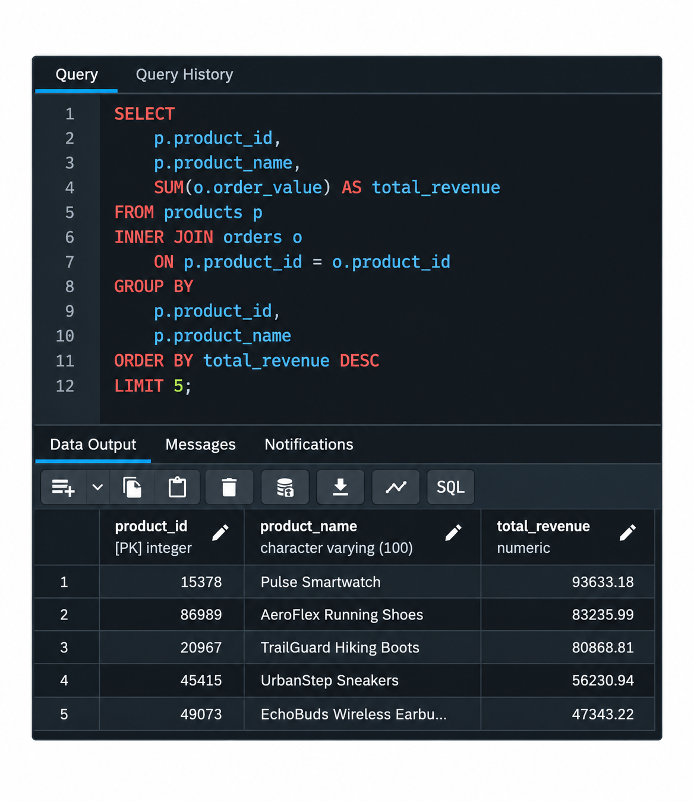
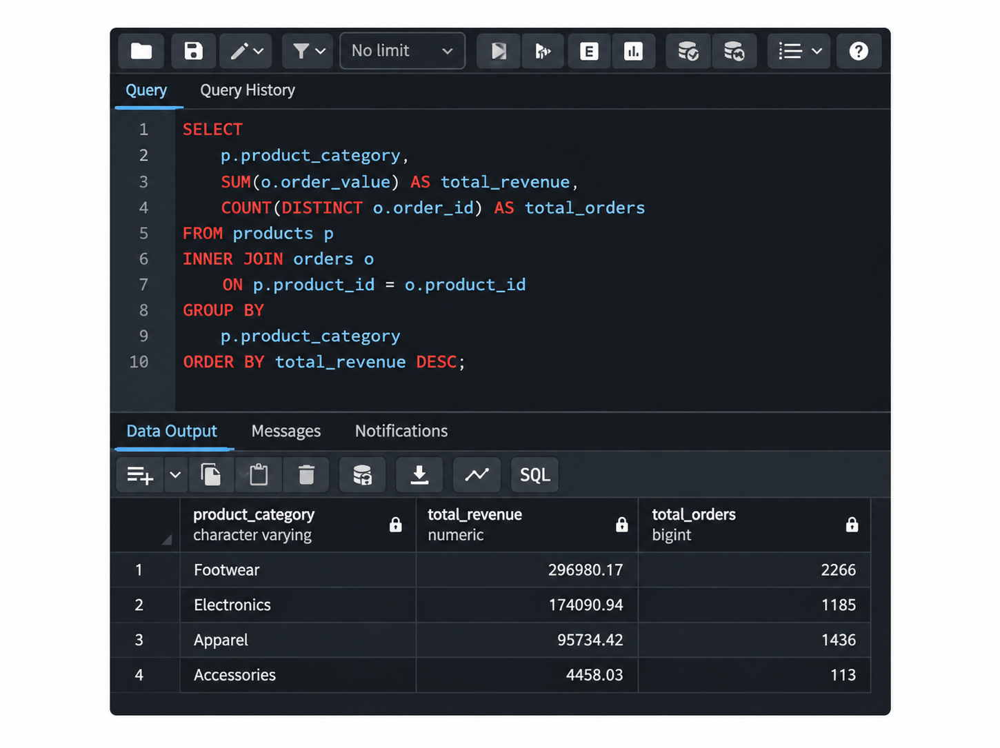
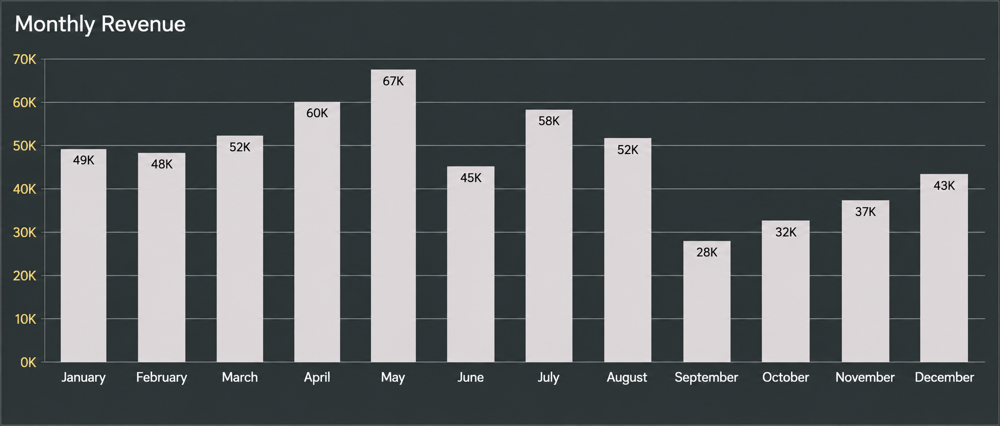
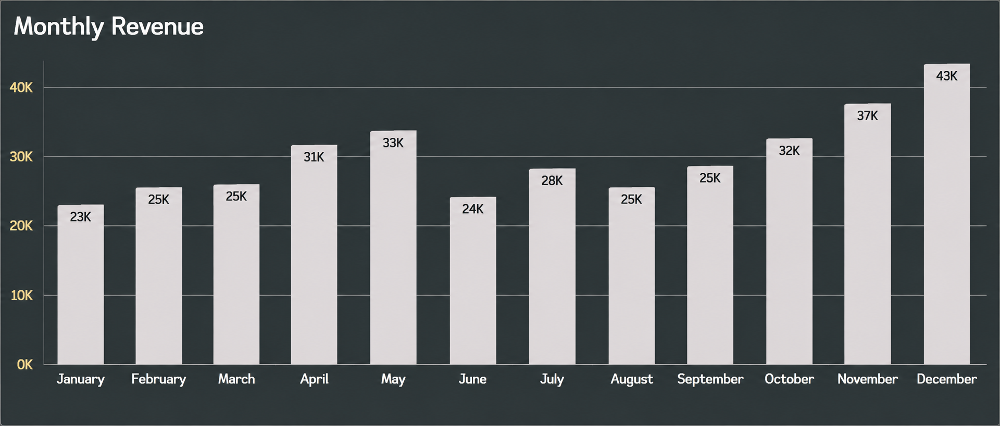
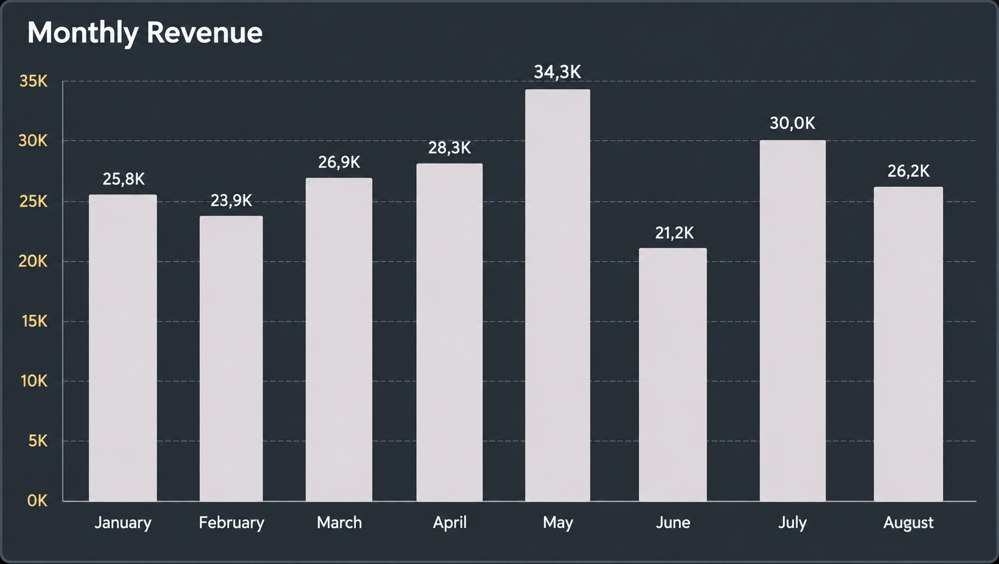
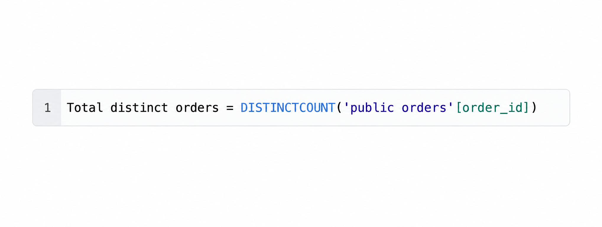
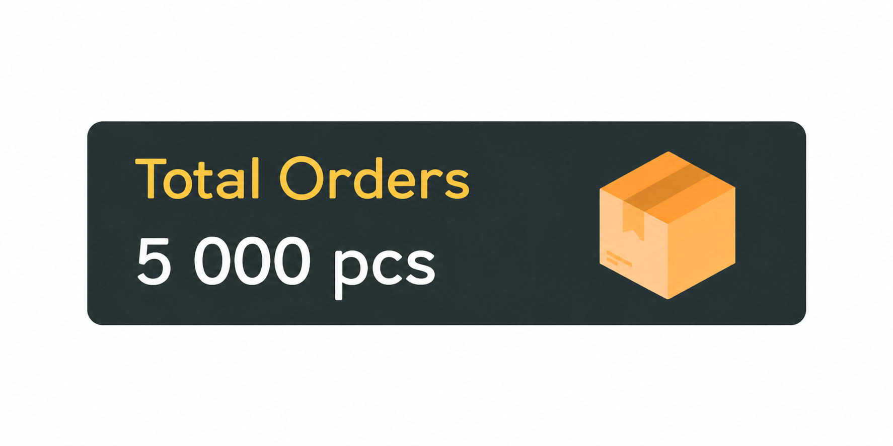
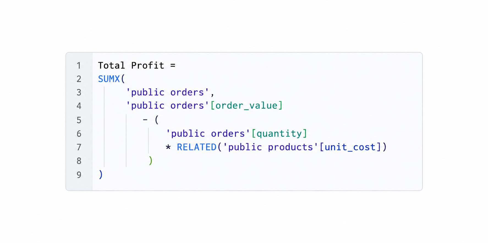
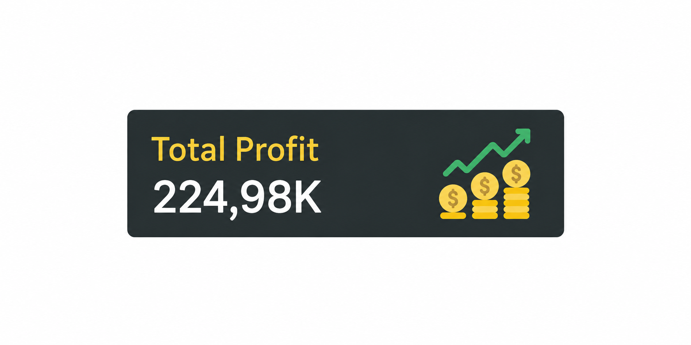

# 📊 End-to-End Sales Data Analysis

> An end-to-end Data Analyst portfolio project covering data preparation, relational database design, SQL analysis, and interactive business intelligence reporting.

---

## 🎯 Project Overview

This project demonstrates a complete **end-to-end data analytics workflow**, starting with raw CSV files and finishing with an interactive **Power BI dashboard**.

The project is based on two related datasets containing:

- 🧾 **5,000 customer orders**
- 📦 **20 products**
- 📅 Sales data covering **2025 and January–August 2026**
- 💰 Revenue, cost, discount, product, and sales information

The objective was to transform and validate the raw data using **Python and Pandas**, store the cleaned datasets in a relational **PostgreSQL database**, perform business analysis using **SQL**, and develop an interactive **Power BI dashboard** using DAX.

---

## 🔄 Project Workflow

**CSV Data → Python & Pandas → PostgreSQL → SQL Analysis → Power BI & DAX → Business Insights**

---

## 🛠️ Tools & Technologies

| Technology | Usage |
|---|---|
| 🐍 **Python** | Data preparation, transformation, and validation |
| 🐼 **Pandas** | Data cleaning and dataset manipulation |
| 📓 **Jupyter Notebook** | Development and documentation of the Python workflow |
| 🐘 **PostgreSQL** | Relational database storage |
| 🔎 **SQL** | Joins, aggregations, and business analysis |
| 📊 **Power BI** | Data modeling and interactive dashboard development |
| 🧮 **DAX** | Revenue, profit, margin, and KPI calculations |

---

# 🐍 01 — Data Preparation with Python

The project started with two raw CSV datasets containing **order-level** and **product-level** data.

Python and Pandas were used to inspect, clean, transform, and validate the datasets before loading them into PostgreSQL.

### 🔍 Data Validation Included

- Checking and correcting data types
- Removing unnecessary whitespace and formatting inconsistencies
- Checking for missing values
- Validating primary key uniqueness
- Validating relationships between the datasets
- Standardizing column names

The following relationship checks were also performed:

- `order_id` is unique in the Orders dataset
- `product_id` is unique in the Products dataset
- Every `product_id` referenced by an order exists in Products
- The dataset intentionally contains **5 products without recorded orders**

This final point makes it possible to analyze both products with sales activity and products that have never generated an order.

### 📸 Python Data Preparation Example


---

# 🐘 02 — PostgreSQL Database & Data Model

After data preparation and validation, the cleaned datasets were loaded into a **PostgreSQL relational database** using Python and SQLAlchemy.

The database contains two related tables:

### 📦 Products

Contains product-level descriptive information including:

`product_id`, product name, category, brand, manufacturing location, size, color, base price, unit cost, and other product attributes.

### 🧾 Orders

Contains transactional sales information including:

`order_id`, `product_id`, `customer_id`, quantity, price, discounts, order value, shipping information, sales channel, payment method, and order status.

### 🔗 Relationship

The tables are connected through `product_id` using a **one-to-many relationship**:

**Products (1) → Orders (*)**

`products.product_id` serves as the **Primary Key**, while `orders.product_id` serves as the corresponding **Foreign Key**.

This structure allows transactional sales data to be analyzed together with descriptive product information.

### 🔌 PostgreSQL Database Connection

The cleaned datasets were loaded from Python into PostgreSQL using **SQLAlchemy**, creating a workflow between the data preparation environment and the relational database.


---

# 🔎 03 — SQL Business Analysis

After loading the datasets into PostgreSQL, SQL was used to explore the data and answer business-oriented questions.

### 💡 Business Questions Investigated

- Which products generated the highest total revenue?
- Which product categories generated the most revenue and orders?
- Which products have no recorded sales?
- How does revenue change over time?

The analysis demonstrates the use of:

`JOIN`, `LEFT JOIN`, `GROUP BY`, `SUM`, `COUNT`, `ORDER BY`, date filtering, and aggregate calculations.

---

### 🏆 Example — Top 5 Products by Revenue

```sql
SELECT
    p.product_id,
    p.product_name,
    SUM(o.order_value) AS total_order_value
FROM products p
INNER JOIN orders o
    ON p.product_id = o.product_id
GROUP BY
    p.product_id,
    p.product_name
ORDER BY
    total_order_value DESC
LIMIT 5;
```

The query identifies the five products that generated the highest total order value.



---

### 🧩 Revenue by Product Category

Product-level information was joined with transactional order data to analyze how revenue was distributed across product categories.

This analysis makes it possible to identify the categories contributing the largest share of overall sales.



---

### 📅 Monthly Revenue Analysis

Revenue was also analyzed over time to identify monthly sales patterns and changes in business performance.

The dataset contains a complete **2025 calendar year**, while **2026 contains data from January through August only**.

Because 2026 represents a partial year, direct full-year comparisons between 2025 and 2026 should be interpreted carefully.







---

# 📊 04 — Power BI & DAX

After completing the SQL analysis, the PostgreSQL database was connected directly to **Power BI**.

The `Products` and `Orders` tables were imported while preserving their **one-to-many relationship** through `product_id`.

Power BI was used to build an interactive business intelligence dashboard focused on revenue, profitability, product performance, and sales trends.

Several **DAX measures** were created to calculate business KPIs dynamically and ensure that all metrics respond to dashboard filters and slicers.

---

## 🧮 Key DAX Measures

### 📦 Total Orders

```DAX
Total Distinct Orders =
DISTINCTCOUNT('public orders'[order_id])
```

This measure calculates the number of unique customer orders in the current filter context.



The resulting KPI shows a total of **5,000 customer orders** across the complete dataset.



---

### 💰 Total Profit

```DAX
Total Profit =
SUMX(
    'public orders',
    'public orders'[order_value]
        - (
            'public orders'[quantity]
            * RELATED('public products'[unit_cost])
        )
)
```

Total Profit represents the estimated profit generated from customer orders after subtracting the corresponding product costs.



The calculation resulted in approximately **224.98K total estimated profit** across the analyzed dataset.



---

### 📈 Profit Margin

```DAX
Profit Margin % =
DIVIDE(
    [Total Profit],
    SUM('public orders'[order_value]),
    0
)
```

Profit Margin measures the percentage of generated revenue remaining after subtracting the product costs included in the analysis.

The final dashboard reports an overall **profit margin of 39.38%**.

This means approximately **39% of sales revenue remains after the product costs included in the calculation**.

The metric provides a useful high-level indicator for comparing profitability across products, categories, time periods, and other dashboard segments.

---

# 📈 05 — Interactive Power BI Dashboard

The final stage of the project combines the prepared data, relational database model, SQL analysis, and DAX calculations into a single **interactive Power BI dashboard**.

The dashboard was designed to provide a concise overview of overall sales performance while still allowing users to explore individual business segments.

### 🎛️ Interactive Filters

Users can dynamically filter the dashboard by:

- 📅 **Year**
- 🗓️ **Month**
- 💳 **Payment Method**
- 🛒 **Sales Channel**

All KPIs and visualizations respond dynamically to these filters.

---

## 📊 Dashboard KPIs

The dashboard contains four primary KPI indicators:

| KPI | Result |
|---|---:|
| 💰 **Total Order Value** | **571.26K** |
| 📈 **Total Profit** | **224.98K** |
| 📊 **Profit Margin** | **39.38%** |
| 📦 **Total Orders** | **5,000** |

Together, these metrics provide an immediate overview of revenue generation, profitability, and sales activity.

---

# 💡 06 — Key Business Insights

The final analysis produced several business-oriented findings from the dataset.

### 💰 Overall Sales Performance

The analyzed customer orders generated approximately **571.26K in total order value** and **224.98K in estimated profit**.

The resulting overall **profit margin is 39.38%**, indicating that a substantial share of sales revenue remains after accounting for the product costs included in the analysis.

---

### 🏆 Product Performance

The strongest-performing products by total revenue were:

1. **Pulse Smartwatch** — approximately **93.6K**
2. **AeroFlex Running Shoes** — approximately **83.2K**
3. **TrailGuard Hiking Boots** — approximately **80.9K**
4. **UrbanStep Sneakers** — approximately **56.2K**
5. **EchoBuds Wireless Earbuds** — approximately **47.3K**

This indicates that a relatively small group of products contributes a significant share of overall revenue.

---

### 🧩 Product Category Performance

Product category analysis shows that revenue is not distributed evenly across categories.

**Footwear** represents the largest revenue contribution in the analyzed dataset, making it a particularly important category from a sales-performance perspective.

Category-level analysis helps identify which product groups contribute most strongly to overall business performance.

---

### 📦 Products Without Sales

The relational dataset intentionally contains **5 products without recorded orders**.

Using a `LEFT JOIN` between Products and Orders made it possible to identify these products separately.

This demonstrates how SQL can be used not only to analyze successful products but also to identify products with **no recorded sales activity**.

---

### 📅 Sales Trends

Monthly analysis shows that revenue fluctuates throughout the analyzed period rather than remaining constant.

The dataset covers the complete **2025 calendar year**, while **2026 only contains sales through August**.

Therefore, 2026 should be treated as a **partial-year dataset**, and its total performance should not be directly compared with the complete 2025 year without accounting for the difference in coverage.

---

# 🎯 Project Outcome

This project demonstrates a complete Data Analyst workflow rather than focusing on a single tool.

The analysis covers the complete process from raw data to business reporting:

### 🔄 End-to-End Pipeline

**Raw CSV Data**  
⬇️  
**Python & Pandas Data Preparation**  
⬇️  
**Data Cleaning & Validation**  
⬇️  
**PostgreSQL Relational Database**  
⬇️  
**SQL Business Analysis**  
⬇️  
**Power BI Data Model**  
⬇️  
**DAX Measures & KPIs**  
⬇️  
**Interactive Dashboard**  
⬇️  
**Business Insights**

---

## 🚀 Skills Demonstrated

Through this project, I demonstrated practical experience with:

- 🐍 **Python-based data preparation**
- 🐼 **Pandas data cleaning and transformation**
- 🔍 **Data quality validation**
- 🐘 **PostgreSQL relational database design**
- 🔗 **Primary Key / Foreign Key relationships**
- 🔎 **SQL joins and aggregations**
- 💡 **Business-oriented SQL analysis**
- 📊 **Power BI data modeling**
- 🧮 **DAX measure development**
- 📈 **KPI development**
- 🎛️ **Interactive dashboard design**
- 💼 **Translating data into business insights**

---

## 📌 Summary

The project demonstrates how multiple analytics technologies can be combined into one structured workflow.

Rather than analyzing data only inside a visualization tool, the project separates the analytics process into distinct stages: **data preparation, validation, relational storage, SQL analysis, data modeling, visualization, and business interpretation**.

This structure reflects a practical end-to-end Data Analyst workflow and demonstrates the ability to work across both the **technical** and **business-facing** sides of analytics.

---

### 🛠️ Technology Stack

`Python` • `Pandas` • `Jupyter Notebook` • `PostgreSQL` • `SQL` • `SQLAlchemy` • `Power BI` • `DAX`

---

⭐ **End-to-End Sales Data Analysis — Data Analyst Portfolio Project**
